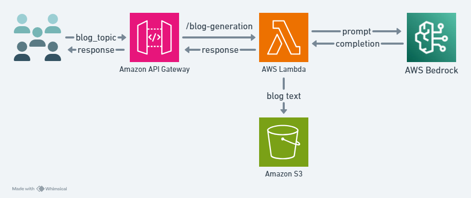

# Steps to use foundational models available in AWS Amazon Bedrock

## Use Case: Blog generation on a given topic using Llama2 chat model.

## AWS services:
- Amazon Bedrock - To access foundational models (Amazon's Titan, Anthropic's Claude, Facebook's Llama, Cohere from Command, Jurassic from AI21 labs, and Stable Diffusion from Stability AI)
- API Gateway - To create API routes for redirecting requests to applications and services.
- Lambda - Takes the user request and calls the logic written to achieve a task. (generating and saving blogs)
- S3 - Storage for blogs generated.
- CloudWatch - To navigate and debug the flow of information as expected.

## Architecture


*Note: boto3 Python SDK is used to interact with Bedrock and S3 from Lambda. Lambda by default uses previous versions of boto3. Therefore you need to create boto3 layer on top of your Lambda function.*

To create a layer in AWS Lamdba for updated packages use the command below. Create a folder named "python" before the command.
```bash
pip install boto3 -t python/
```

Zip the folder and give appropriate name.

How to setup everything (step-by-step guide)?
[Amazon Bedrock](How-to-setup/Using_Amazon_Bedrock.pdf)

